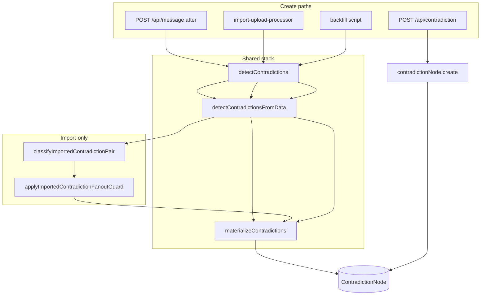

# 01 — Current contradiction write paths

**Phase:** A — read-only trace
**Scope:** Every path capable of creating or modifying a `ContradictionNode`

---

## Shared core stack

Most automated paths share:

| Layer | File | Function |
|-------|------|----------|
| Async loader | `lib/contradiction-detection.ts` | `detectContradictions` (L215–278) |
| Pure detector | `lib/contradiction-detection.ts` | `detectContradictionsFromData` (L143–213) |
| Materializer | `lib/contradiction-materialization.ts` | `materializeContradictions` (L131–241) |

Import-only additions:

| Layer | File | Function |
|-------|------|----------|
| Pair classifier | `lib/import-chatgpt.ts` | `classifyImportedContradictionPair` (L681–806) |
| Fanout guard | `lib/import-chatgpt.ts` | `applyImportedContradictionFanoutGuard` (L816–855) |

---

## Create paths

### Path 1 — Live chat / Explore / journal (background extraction)

| Attribute | Detail |
|-----------|--------|
| **Entry point** | `app/api/message/route.ts` → `after()` block (L362–381) |
| **Trigger** | Any `POST /api/message` when content length ≥ 15 |
| **Detector** | `detectContradictions` — default `referenceStatuses: ["active"]` |
| **Classifier** | **None** — import gates skipped |
| **Candidate construction** | Marker substring → fan-out all goal or constraint refs |
| **DB function** | `materializeContradictions` (default `newNodeStatus: "candidate"`) |
| **Transaction boundary** | Post-response `after()`; **not** in message-create transaction |
| **Source records** | User-wide goal/constraint `ReferenceItem` (≤50) + appendable existing nodes (≤50) |
| **Initial status** | `candidate` |
| **Duplicate prevention** | In-detector `findExistingNodeId` / `isSimilarText`; materializer exact collision + evidence dedup |
| **Evidence / lineage** | `ContradictionEvidence` quote = message; CN `sourceSessionId`/`sourceMessageId` = Side B message |
| **Shared implementation** | Partial — detect + materialize shared; no import classifier |

---

### Path 2 — ChatGPT import (primary production create path for Kay's 25)

| Attribute | Detail |
|-----------|--------|
| **Entry point** | `lib/import-upload-processor.ts` → `processChatImportSession` → `importExtractedConversations` |
| **Import core** | `lib/import-chatgpt.ts` L1306–1658; detection loop L1503–1627 |
| **Trigger** | Upload finalize → queued import processing |
| **Detector** | `detectContradictions` with `referenceStatuses: ["active", "candidate"]` |
| **Classifier** | `classifyImportedContradictionPair` → `applyImportedContradictionFanoutGuard` |
| **Candidate construction** | Shared detector output filtered per pair |
| **DB function** | `materializeContradictions` |
| **Transaction boundary** | Session+messages per-conversation `$transaction`; detection/materialize **outside** that transaction, per message |
| **Source records** | User-wide refs + refs extracted earlier in same import run |
| **Initial status** | `candidate` |
| **Duplicate prevention** | Shared materializer + fanout cap (`IMPORTED_CONTRADICTION_SIDE_FANOUT_CAP = 3`) |
| **Evidence / lineage** | Side B evidence row; optional `DerivationArtifact` type `contradiction_candidate` (artifact only) |
| **Shared implementation** | Partial — shared detect + materialize; import-only quality gates |

Post-import modify-only: `reconcileImportedStructureForUser` (`lib/import-reconcile.ts` L85–174) updates escalation fields on `open`/`explored` nodes only.

---

### Path 3 — Backfill script

| Attribute | Detail |
|-----------|--------|
| **Entry point** | `scripts/backfill-imported-contradictions.ts` → `lib/contradiction-backfill.ts` |
| **Trigger** | CLI `--user-id` or `--all-users` |
| **Detector** | `detectContradictions` with `["active", "candidate"]` |
| **Classifier** | **None** |
| **DB function** | `materializeContradictions` with explicit `newNodeStatus` |
| **Transaction boundary** | Per-message materialize transaction |
| **Initial status** | **`open`** (default in backfill lib) — **differs from import/live** |
| **Shared implementation** | Partial — same detect + materialize; **no import gates** |

---

### Path 4 — Manual API create (orphaned)

| Attribute | Detail |
|-----------|--------|
| **Entry point** | `app/api/contradiction/route.ts` → `POST` (L60–176) |
| **Detector** | **None** — client supplies title/sides/type |
| **DB function** | `tx.contradictionNode.create` + optional `contradictionEvidence.createMany` |
| **Transaction boundary** | Single `$transaction` |
| **Initial status** | Schema default **`open`** (omitted on create) |
| **Duplicate prevention** | **None** |
| **Shared implementation** | **No** — bypasses detection stack |

Receipt note: UI "Log Conflict" unwired (`INTELLIGENCE-COMPATIBILITY-AUDIT-001/07-current-live-entry-paths.md`).

---

## Modification-only paths

| # | Entry | File | What changes | Status change |
|---|-------|------|--------------|---------------|
| 5 | Materialization reuse | `lib/contradiction-materialization.ts` L161–197 | Append evidence, increment counts | None |
| 6 | Import review accept | `lib/import-candidate-review-actions.ts` → `materialiseAcceptedContradiction` L259–390 | UEL links, optional ModelUpdate | `candidate` → `open` |
| 7 | Import review reject | `lib/import-candidate-review-actions.ts` L475–478 | Status only | → `archived_tension` |
| 8 | PATCH lifecycle | `app/api/contradiction/[id]/route.ts` + `lib/contradiction-transitions.ts` | Actions, optional evidence | snooze, explore, resolve, etc. |
| 9 | Evidence add API | `lib/contradiction-evidence.ts` | New evidence row | None |
| 10 | Snooze expiry | `lib/contradiction-snooze-expiry.ts` | `updateMany` on read | `snoozed` → `open` |
| 11 | Surfacing (recorded) | `lib/contradiction-surface.ts` L195–249 | weight, timesSurfaced, escalation | None |
| 12 | Import reconcile | `lib/import-reconcile.ts` | escalationLevel, recommendedRung | None |
| 13 | Candidate DELETE | `app/api/contradiction/[id]/route.ts` L340–379 | Hard delete candidate + evidence | Deleted |

**Accept path duplication:** Import overlay accept writes UEL + MU; legacy `confirm_candidate` PATCH (`contradictions/candidates/page.tsx`) only flips status — no UEL/MU.

---

## Paths that do NOT write ContradictionNode

| Path | File | Role |
|------|------|------|
| Derivation layer | `lib/derivation-layer.ts` | Lists artifact types only |
| Live evidence depth | `lib/live-evidence-depth-write-path.ts` | Reads CN for pointer authoring |
| Drift adapter | `lib/contradiction-drift-adapter.ts` | Read adapter |
| Map projection | `lib/map-open-contradictions.ts` | Read projection |
| Reference link API | `app/api/contradiction/[id]/references/route.ts` | Upserts `ContradictionReferenceLink`, not CN |

---

## Test / fixture paths

| Artifact | Creates CN in DB? |
|----------|-------------------|
| `lib/map-contradiction-projection-fixture.ts` | No — in-memory only |
| Unit tests (`contradiction-materialization.test.ts`, etc.) | Mock DB |
| `lib/seed-lower-family-validation-fixtures.ts` | Counts only |

---

## Shared implementation matrix

| Path | detectContradictions | import classifier | fanout guard | materializeContradictions | Default create status |
|------|:---:|:---:|:---:|:---:|:---:|
| Live message | ✓ | ✗ | ✗ | ✓ | `candidate` |
| Import | ✓ | ✓ | ✓ | ✓ | `candidate` |
| Backfill | ✓ | ✗ | ✗ | ✓ | **`open`** |
| Manual POST | ✗ | ✗ | ✗ | ✗ | **`open`** |

---

## Notable inconsistencies (repair inputs)

1. **Create status split** — live/import write `candidate`; backfill and manual POST default `open`.
2. **Backfill skips import quality gates** — can recreate defects import filters reduce.
3. **Live path skips import classifier** — Explore/journal messages get raw marker detection.
4. **Lineage asymmetry** — CN row stores Side B session/message only; Side A on ReferenceItem, not linked at materialization.
5. **Accept UEL path** — Side B message/spans/session/import batch only; no Side A reference link.

---

## Architecture diagram

