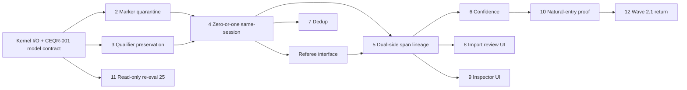

# 07 — Bounded repair slice plan

**Phase:** A — dependency-ordered implementation plan (no code in Phase A)
**Clarification:** Shared Orvek Intelligence Kernel; ContradictionNode is first proof case
**Principle:** Smallest sufficient slices; do not rebuild every object type in this campaign.

---

## Campaign scope control

### This campaign may

- Define the shared reusable Intelligence Kernel
- Implement its **first** bounded ContradictionNode path in later slices
- Add only the **minimum** shared infrastructure required for that path
- Prove the contradiction path through controlled natural entry

### This campaign must not

- Rebuild every object type
- Migrate every existing detector
- Add a full multi-agent system
- Implement an Intelligence Library
- Implement autonomous background behaviour without bounded triggers
- Turn the Objectivity Referee into one opaque all-powerful prompt
- Alter the existing 25 candidates without separate authorisation

Later campaigns may migrate ReferenceItem, goals, decisions, outcomes, PatternClaims, Investigations, UserMapConclusions, ModelUpdates, and reports onto the shared kernel.

---

## Shared kernel stages (see `11-shared-intelligence-kernel-architecture.md`)

1. Evidence and context assembly
2. AI semantic proposition extraction
3. Candidate object classification and routing
4. Object-specific semantic adjudication
5. Shared Objectivity Referee
6. Deterministic evidence and schema validation
7. Persistence, lower-confidence routing or abstention
8. Versioned audit receipt

**Router vs adjudicator:** Shared router proposes object kinds; it must **not** persist. Contradiction-specific adjudicator owns CN eligibility (`04`, `11`).

**Execution tiers:** Immediate capture / background intelligence / promotion / read path — one shared architecture ≠ one large synchronous AI call (`11`).

---

## Slice dependency graph



---

## CEQR-005 dependency gate (controlling)

**CEQR-005 (bounded provenance migration) cannot begin until CEQR-001 through CEQR-004 have established and tested:**

| Prerequisite | Source |
|--------------|--------|
| Shared kernel input/output contract | `11` + CEQR-001 |
| Model-assisted semantic contract | `04` + CEQR-001 |
| Compatible-state rejection | CEQR-001 / tests |
| Marker-only quarantine | CEQR-002 |
| Qualifier preservation | CEQR-003 |
| Zero-or-one same-session selection | CEQR-004 + `05` |
| Exact provenance objects supplied to candidate construction | CEQR-001–004 |
| Deterministic source-span validation | CEQR-001 + tests in `08` |
| Contradiction-specific adjudicator boundary | `11` |
| Shared Objectivity Referee interface | `12` |

The migration must support a **proven** candidate contract rather than define that contract prematurely.

---

## Slice 1 — CEQR-001 Model-assisted semantic adjudication (kernel foundation)

| Attribute | Detail |
|-----------|--------|
| **Goal** | Shared kernel stage 2–4 for contradiction: model-assisted structured result per `04`; **not** regex enlargement |
| **Files likely** | New kernel modules under `lib/` (names TBD in implement slice); wire from contradiction detection / import paths; shared types for router + adjudicator I/O |
| **Schema impact** | None |
| **DB mutation** | None in unit tests; mock model client |
| **Tests** | Structured output schema; Class A/B/C/D; abstention; markers ≠ eligibility; span text validation helpers |
| **Human gate** | Kay review of contract + sample adjudications |
| **Stop condition** | Du Bois near-miss not false Class A; model encouraged to abstain |
| **Campaign** | **This campaign** — minimum shared infrastructure |

---

## Slice 2 — CEQR-002 Marker-only creation quarantine

| Attribute | Detail |
|-----------|--------|
| **Goal** | Markers/token overlap retrieval-only; cannot create CN |
| **Files likely** | Detection/import nomination layers |
| **Schema impact** | None |
| **Stop condition** | `"but i"` alone never creates CN |
| **Campaign** | **This campaign** |

---

## Slice 3 — CEQR-003 Qualifier preservation

| Attribute | Detail |
|-----------|--------|
| **Goal** | Model result + deterministic checks preserve hedges, partial compliance, uncertainty vs negation |
| **Depends on** | CEQR-001 |
| **Stop condition** | Partial compliance → B not A |
| **Campaign** | **This campaign** |

---

## Slice 4 — CEQR-004 Same-session + zero-or-one eligible selection

| Attribute | Detail |
|-----------|--------|
| **Goal** | Same-session only; select **zero or one** ref after semantic pass; ban fan-out and forced-one; ranking among ineligible refs insufficient |
| **Files likely** | Detection nomination + adjudicator wiring |
| **Schema impact** | None |
| **Stop conditions** | Cross-session impossible; zero eligible → no CN; no token-overlap fallback candidate |
| **Campaign** | **This campaign** |

---

## Slice 5 — CEQR-005 Dual-side span lineage (bounded migration)

| Attribute | Detail |
|-----------|--------|
| **Goal** | Persist Design A (`sideASourceSpanId`) or Design B (guaranteed chain to exact span); Side B exact span; no orphan refs; no fabricated spans |
| **Depends on** | **CEQR-001–004 + referee interface (gate above)** |
| **Schema impact** | Bounded migration — authorised only when span-resolution path named and tested |
| **Presentation** | Import/Inspector must not imply symmetric lineage until true |
| **Existing 25** | No backfill required; remain pre-repair cohort |
| **Campaign** | **This campaign** |

---

## Slice 6 — CEQR-006 Confidence calibration

| Attribute | Detail |
|-----------|--------|
| **Goal** | Confidence from model + referee outcomes; remove fixed type labels |
| **Campaign** | **This campaign** |

---

## Slice 7 — CEQR-007 Duplicate prevention

| Attribute | Detail |
|-----------|--------|
| **Goal** | Session/span-scoped dedup; no sibling CNs from identical Side B |
| **Campaign** | **This campaign** |

---

## Slice 8 — CEQR-008 Import review dual-source presentation

| Attribute | Detail |
|-----------|--------|
| **Goal** | Show both sides’ sessions/messages/**spans** when present; warn on legacy incomplete lineage; never imply symmetry until provenance true |
| **Depends on** | CEQR-005 |
| **Campaign** | **This campaign** |

---

## Slice 9 — CEQR-009 Inspector dual-source presentation

| Attribute | Detail |
|-----------|--------|
| **Goal** | Symmetric inspectable lineage for post-repair CNs; honest incomplete state for legacy |
| **Depends on** | CEQR-005 |
| **Campaign** | **This campaign** |

---

## Slice 10 — CEQR-010 Controlled natural-entry proof

| Attribute | Detail |
|-----------|--------|
| **Goal** | Natural entry → kernel → candidate → dual-span evidence → review → accept → Map → Inspector |
| **Human gate** | Kay |
| **Campaign** | **This campaign** |

---

## Slice 11 — CEQR-011 Read-only re-evaluation of existing 25

| Attribute | Detail |
|-----------|--------|
| **Goal** | Receipt-only classification; **no** status change; visibly `preRepairCohort` |
| **DB mutation** | **None** |
| **Disposition** | No Accept/Reject/archive authorised |
| **Campaign** | **This campaign** (read-only) |

---

## Slice 12 — CEQR-012 Return to Wave 2.1

| Attribute | Detail |
|-----------|--------|
| **Goal** | Proof on **new** trustworthy candidate only |
| **Campaign** | **Later wave** after CEQR-010 |

---

## Latency / execution (slice implications)

| Path | Behaviour |
|------|-----------|
| Immediate capture | Save user content without waiting for full Tier 2–4 |
| Background intelligence | Tier 1–2 async where appropriate |
| Promotion | Tier 3 referee + persistence before durable model movement / high-confidence claims |
| Read path | Today / Map / Timeline / Inspector read stored intelligence — no full model rerun per page view |

---

## Out of scope / later campaigns

| Item | Reason |
|------|--------|
| Other object types on kernel | Later campaigns |
| Cross-session temporal belief change | Deferred (`05`) |
| Bulk disposition of pre-repair 25 | Separate authorisation (`06`) |
| Full multi-agent / Intelligence Library | Out of scope |
| Opaque mega-prompt referee | Forbidden (`12`) |

---

## Suggested implementation order

1. CEQR-001 (model-assisted kernel contract + contradiction adjudicator)
2. CEQR-002 + CEQR-003
3. CEQR-004 (zero-or-one same-session)
4. Referee interface skeleton (`12`) as code contract before CEQR-005
5. CEQR-005 (migration — after dependency gate)
6. CEQR-006 + CEQR-007
7. CEQR-008 + CEQR-009
8. CEQR-011 (read-only)
9. CEQR-010 (natural-entry proof)
10. CEQR-012 (Wave 2.1)

---

## Verification per slice

```bash
bash scripts/verify-mindlab.sh
```

Plus `08-required-test-matrix.md`.

**Production readiness:** **NO** until CEQR-012 complete and Kay accepts proof.
