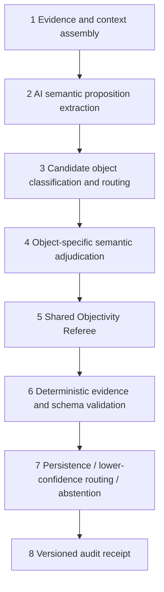

# 11 — Shared Orvek Intelligence Kernel architecture

**Phase:** A — architecture definition (receipts only; no implementation)
**Campaign role:** Define the reusable backend intelligence architecture. ContradictionNode is the **first** bounded implementation and proof case — not a contradiction-only pipeline to later duplicate.

---

## Controlling principle

**AI determines what the evidence may mean.**

**Deterministic code verifies where the evidence came from, what object schemas are permitted, and what the system may persist.**

Do not design a contradiction-only AI pipeline that later must be copied for ReferenceItems, goals, decisions, outcomes, PatternClaims, Investigations, User Map conclusions, Model Updates, or reports.

---

## Bounded stages

### 1. Evidence and context assembly

Assemble user-scoped, origin-correct evidence packets: messages, spans, sessions, existing objects in scope. Deterministic. No semantic eligibility yet.

### 2. AI semantic proposition extraction

Model-assisted extraction of normalized propositions, actors, subjects, timeframes, modality, negation, qualifications, and exact evidence span claims. Markers/token overlap may **nominate** inputs only.

### 3. Candidate object classification and routing

Shared router proposes what the evidence **appears** to describe (see router vocabulary below). Router **does not persist** final objects.

### 4. Object-specific semantic adjudication

Object-type adjudicator applies eligibility contracts. For this campaign: **ContradictionNode adjudicator** only (`04-target-semantic-contract.md`).

### 5. Shared Objectivity Referee

Cross-object quality gate (`12-objectivity-referee-gap-and-integration.md`). Outcomes: PASS, PASS_WITH_LOWER_CONFIDENCE, ROUTE_TO_DIFFERENT_OBJECT_TYPE, REQUEST_MORE_EVIDENCE, ABSTAIN. Cannot bypass stage 6.

### 6. Deterministic evidence and schema validation

Validate spans against original text; schema permissions; same-session / zero-or-one rules; no orphan refs; no fabricated evidence.

### 7. Persistence, lower-confidence routing or abstention

Write candidate / hold / route / abstain according to referee + validation. Promotion to durable model movement is a separate tier.

### 8. Versioned audit receipt

Record processor version, inputs hashes, model contract version, referee outcome, persistence decision — inspectable, non-fake.

---

## Shared router vs object-specific adjudication

### A. Shared semantic interpretation and routing

The shared router may propose that evidence appears to describe:

- preference
- belief
- goal
- intention
- decision
- action
- outcome
- emotional state
- repeated pattern
- contradiction
- unresolved question
- correction
- contextual information
- nothing durable

**The router may not itself persist the final object.**

### B. Object-specific eligibility contracts

Each object type must later have its own adjudicator. Examples:

| Object | Example eligibility (illustrative; not implemented here) |
|--------|----------------------------------------------------------|
| PatternClaim | Recurrence and episode spread |
| ContradictionNode | Related propositions + incompatibility (Class A) or meaningful unresolved tension only if a tension object exists |
| Decision | Alternatives + selection/commitment |
| Goal | Desired future state + sufficient commitment |
| Outcome | Result linked to action, decision, or attempt |
| UserMapConclusion | Evidence sufficiency + longitudinal support |
| ReferenceItem | Durable statement type + provenance |
| Investigation | Unresolved question with safe anchors |
| ModelUpdate | Meaningful delta + linked affected object |
| Report input | Contracted fields from stored intelligence |
| No object / abstain | Default when evidence insufficient |

**This campaign implements only the ContradictionNode adjudicator path** (plus minimum shared kernel stages required for that path).

---

## Eventual routing targets (not all implemented now)

- ReferenceItem
- goal
- decision
- outcome
- PatternClaim
- ContradictionNode ← **first proof case**
- Investigation
- UserMapConclusion
- ModelUpdate
- report input
- no object / abstain

---

## Latency, cost, and execution boundaries

One shared intelligence architecture **does not** mean one large synchronous AI call on every interaction.

### Paths

| Path | Behaviour |
|------|-----------|
| **Immediate capture** | User content is saved without waiting for full longitudinal analysis |
| **Background intelligence** | Semantic extraction and candidate proposal run asynchronously where appropriate |
| **Promotion** | Stronger adjudication and objectivity checks run before durable model movement, high-confidence claims, or user-visible promotion |
| **Read path** | Today, Map, Timeline, and Inspector normally read already-produced stored intelligence and do **not** rerun the full model on every page view |

### Tiered execution model

| Tier | Work |
|------|------|
| **Tier 1** | Lightweight extraction and possible object routing |
| **Tier 2** | Object-specific semantic adjudication |
| **Tier 3** | Objectivity Referee and persistence gate |
| **Tier 4** | Longitudinal synthesis and model movement |

No exact model provider or pricing decision is required in Phase A.

Contradiction v1 may use Tier 1 nomination (markers/overlap) → Tier 2 contradiction adjudicator → Tier 3 referee → Tier 6 deterministic validation → persist candidate. Tier 4 is out of scope for first CN proof.

---

## Contradiction-first implementation boundary

| In this campaign | Out of this campaign |
|------------------|----------------------|
| Kernel stage contracts + types | Full multi-object migration |
| Contradiction adjudicator | PatternClaim / UMC / Decision adjudicators |
| Minimum shared stages for CN path | Intelligence Library |
| Controlled natural-entry CN proof | Autonomous unbounded background agents |
| Bounded referee interface for CN | Opaque mega-prompt that replaces all gates |

---

## Relationship to existing systems

| Existing | Role relative to kernel |
|----------|-------------------------|
| Current contradiction marker detector | Legacy nomination — to be quarantined (CEQR-002) |
| Import pair classifier | Legacy retrieval assist — not eligibility |
| Dark-engine + objectivity gates | Object-specific predecessors for UMC/MU — see `12` |
| Reality-tracking report contract | Read/report path consumer of stored intelligence |
| Map / Inspector | Read path |

---

## Production readiness

**NO** — architecture receipt only.
